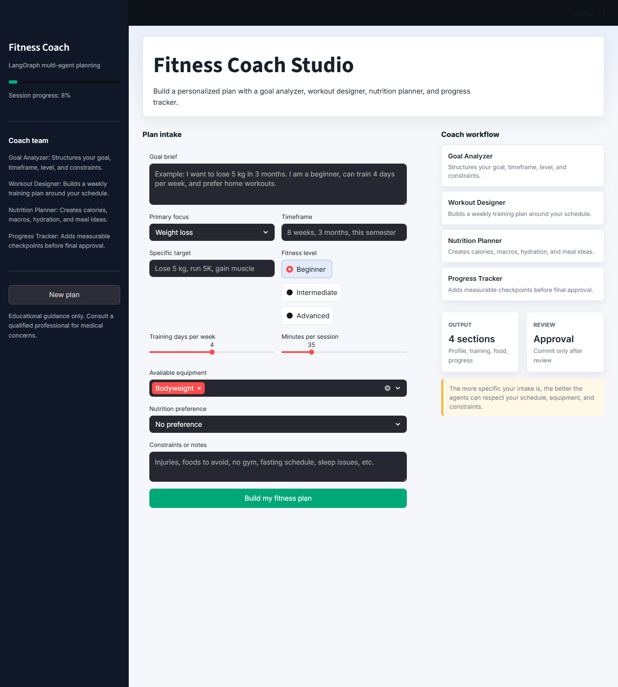
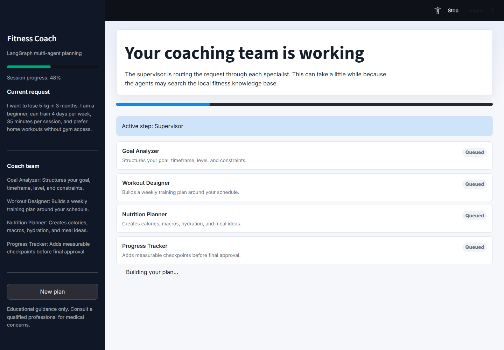
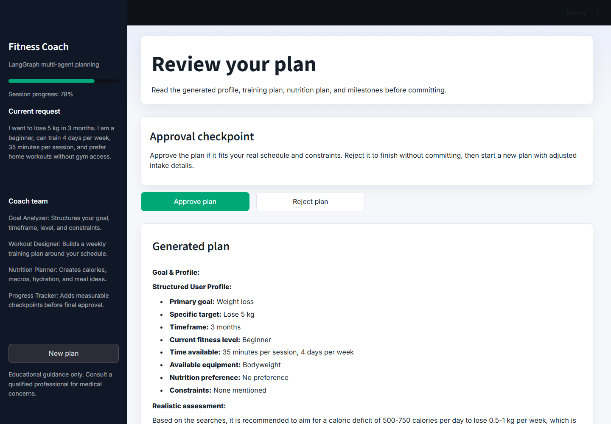
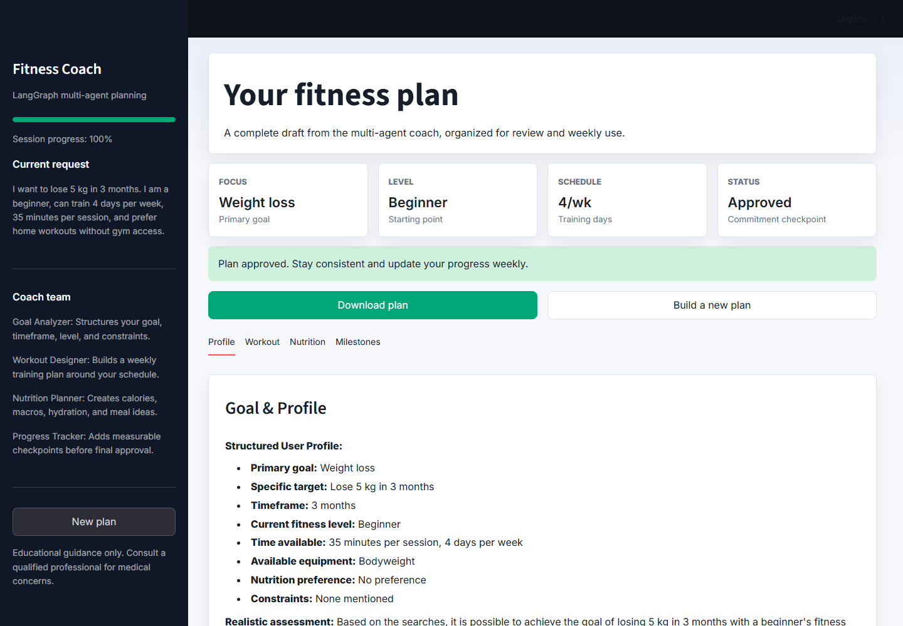
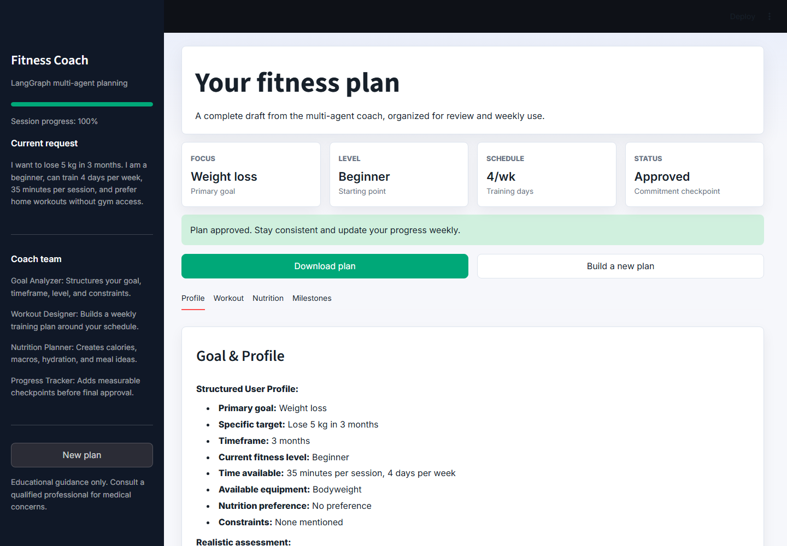
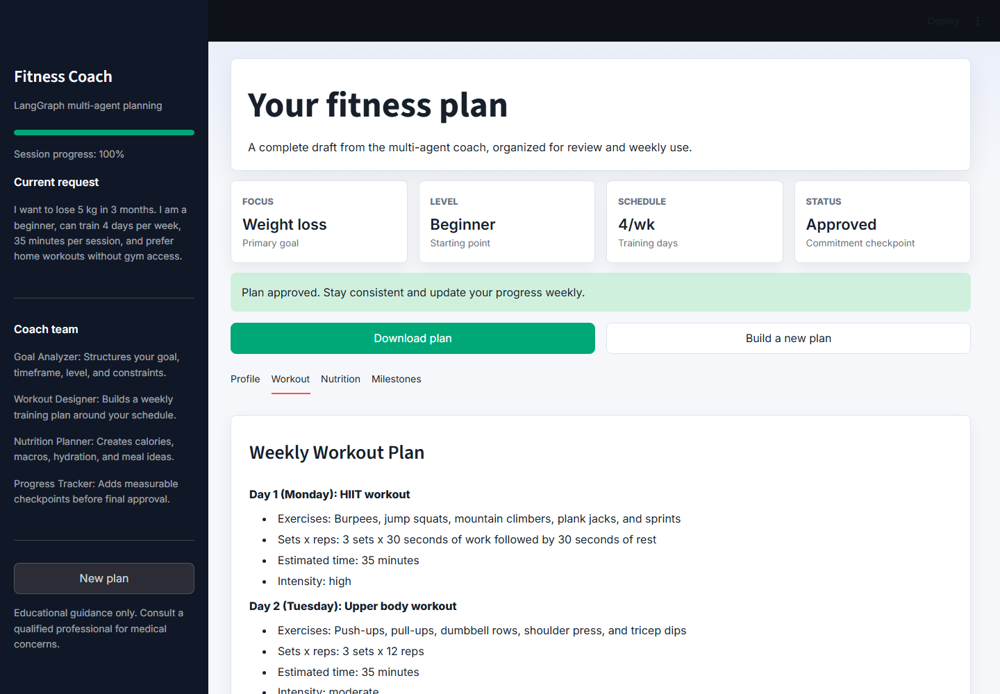
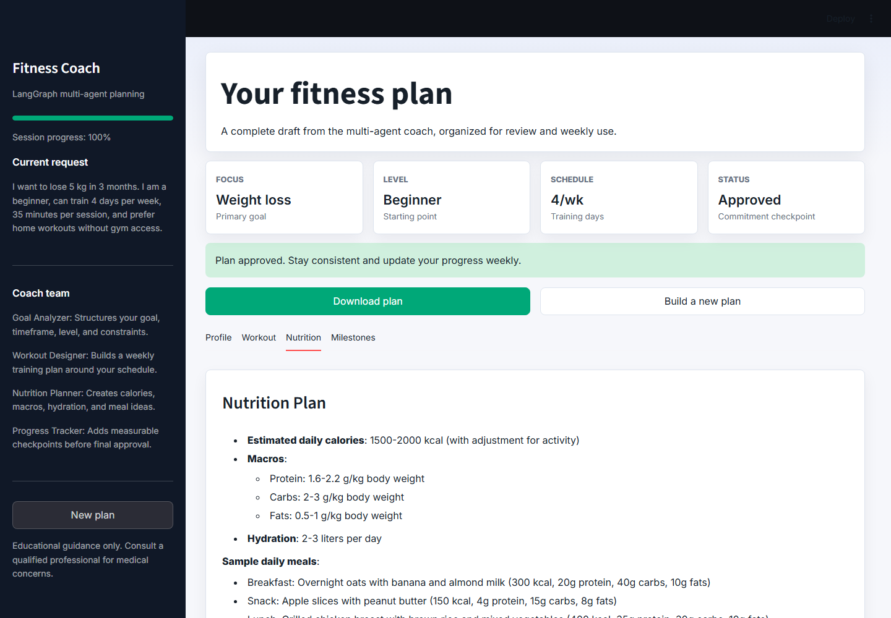
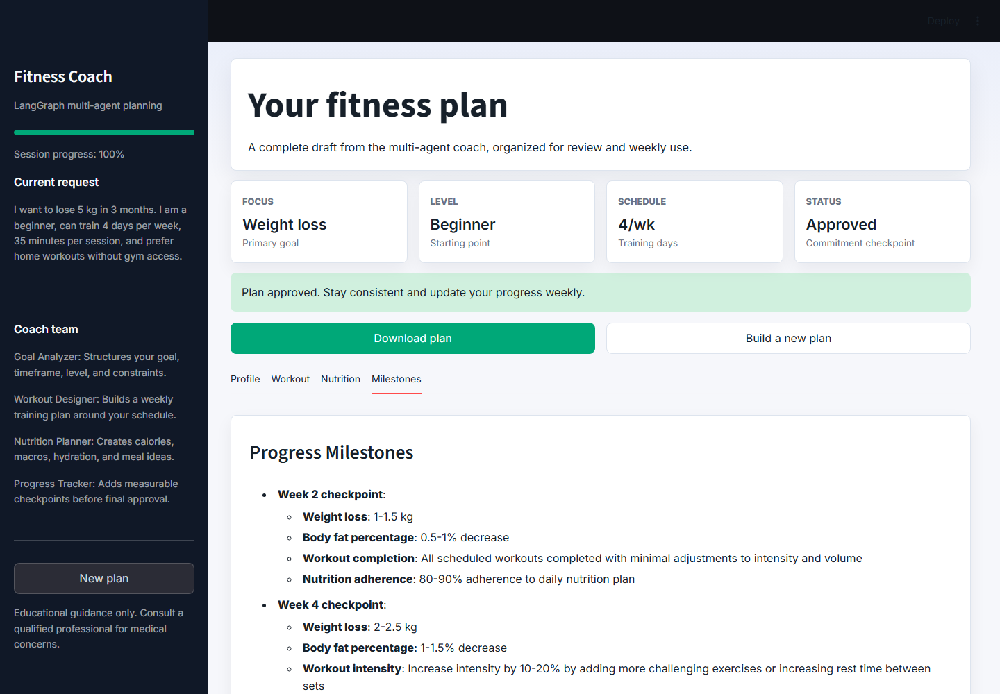
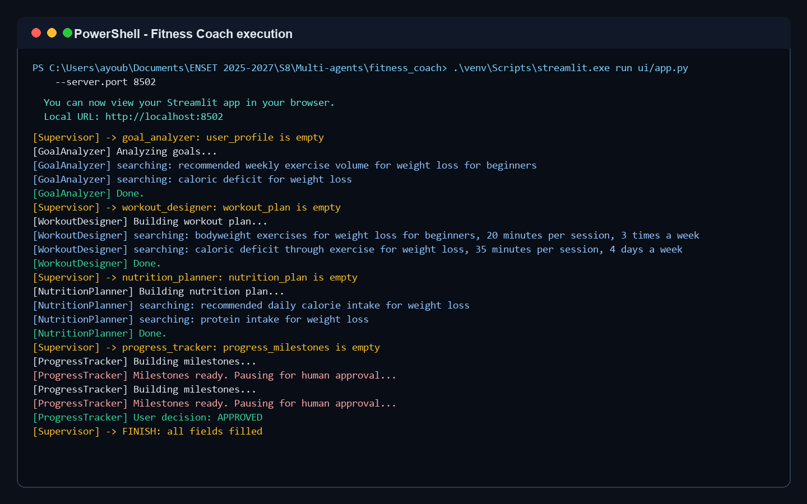

# Fitness Coach Multi-Agent

Projet de fin de module pour le Master SDIA, module **SMA**, encadré par **Prof. RETAL Sara**.

Ce projet implémente un système multi-agent de coaching fitness. L'utilisateur décrit son objectif, puis plusieurs agents spécialisés collaborent pour produire un profil structuré, un programme d'entraînement, un plan nutritionnel et des jalons de progression. Le plan final est validé par l'utilisateur grâce à un point Human-in-the-loop.

## Fonctionnalités

- Orchestration multi-agent avec **LangGraph**
- Superviseur hiérarchique déterministe
- Agents spécialisés : analyse d'objectif, entraînement, nutrition, progression
- RAG agentique avec **ChromaDB** et documents PDF
- Validation humaine avant finalisation du plan
- Evaluation A/B des prompts
- Interface web **Streamlit** redesignée
- Téléchargement du plan final en Markdown

## Répartition équitable des tâches

Conformément à la consigne d'organisation autonome du groupe, les tâches ont été réparties de manière équilibrée entre les trois membres. Chaque personne a pris en charge une partie de développement, une partie de test/intégration et une contribution à la documentation ou à la démonstration.

| Membre | Développement principal | Tests, intégration et livrables |
| --- | --- | --- |
| **ETTALEBY MBAREK** | Orchestration LangGraph, superviseur déterministe, état partagé `FitnessState`, agent `goal_analyzer` et point Human-in-the-loop. | Graphe d'exécution, routage des agents, extraction du profil utilisateur, tests du workflow et rédaction de la partie orchestration. |
| **OUSSAMA FELOUACH** | Agents `workout_designer` et `nutrition_planner`, intégration RAG, ingestion des PDF et base vectorielle ChromaDB. | Programme d'entraînement, plan nutritionnel, outil `search_fitness_knowledge`, tests RAG et rédaction de la partie connaissances/agents. |
| **AYOUB EL HOUANI** | Agent `progress_tracker`, interface Streamlit, affichage des résultats, évaluation A/B des prompts et préparation de la démonstration. | Jalons de progression, formulaire web, onglets de résultat, export Markdown, captures, tests d'interface et finalisation du rapport LaTeX. |

L'intégration finale, la correction des erreurs, les tests du scénario complet et la préparation de la présentation ont été réalisés collectivement.

## Démonstration vidéo

La vidéo suivante montre un test complet de l'application : saisie du prompt, génération par les agents, validation Human-in-the-loop, consultation des quatre onglets du résultat final et téléchargement du plan.

[Voir la vidéo de démonstration](docs/demo/fitness_coach_test_flow.mp4)

Le fichier téléchargé pendant ce test est disponible dans :

```text
docs/demo/downloads/fitness_plan.md
```

## Aperçu de la plateforme

<table>
  <tr>
    <td width="50%">
      <strong>Intake</strong><br>
      
      <br><sub>Formulaire guidé où l'utilisateur décrit son objectif, son niveau, son planning, son matériel et ses contraintes.</sub>
    </td>
    <td width="50%">
      <strong>Génération par les agents</strong><br>
      
      <br><sub>Écran d'exécution montrant le workflow multi-agent pendant la génération du plan personnalisé.</sub>
    </td>
  </tr>
  <tr>
    <td width="50%">
      <strong>Validation Human-in-the-loop</strong><br>
      
      <br><sub>Point de contrôle humain : l'utilisateur relit le plan généré avant de l'approuver ou de le rejeter.</sub>
    </td>
    <td width="50%">
      <strong>Résultat final</strong><br>
      
      <br><sub>Vue finale après approbation, avec le statut du plan, le bouton de téléchargement et les onglets de consultation.</sub>
    </td>
  </tr>
</table>

### Onglets du résultat final

<table>
  <tr>
    <td width="50%">
      <strong>Profile</strong><br>
      
      <br><sub>Profil structuré extrait par l'agent Goal Analyzer à partir de la demande utilisateur.</sub>
    </td>
    <td width="50%">
      <strong>Workout</strong><br>
      
      <br><sub>Programme d'entraînement hebdomadaire généré selon le niveau, le temps disponible et le matériel.</sub>
    </td>
  </tr>
  <tr>
    <td width="50%">
      <strong>Nutrition</strong><br>
      
      <br><sub>Plan nutritionnel avec calories estimées, macros, hydratation et idées de repas.</sub>
    </td>
    <td width="50%">
      <strong>Milestones</strong><br>
      
      <br><sub>Jalons de progression et métriques à suivre pour mesurer l'évolution semaine après semaine.</sub>
    </td>
  </tr>
</table>

### Terminal d'exécution

<table>
  <tr>
    <td>
      <strong>Terminal</strong><br>
      
      <br><sub>Trace d'exécution montrant le routage du superviseur, les recherches RAG et la validation finale.</sub>
    </td>
  </tr>
</table>

## Architecture

```text
Utilisateur
   |
   v
Interface Streamlit
   |
   v
LangGraph
   |
   +--> Supervisor
          |
          +--> Goal Analyzer
          +--> Workout Designer
          +--> Nutrition Planner
          +--> Progress Tracker
                  |
                  +--> Human-in-the-loop approval

Agents <--> RAG Tool <--> ChromaDB <--> PDF documents
```

## Agents

| Agent | Rôle |
| --- | --- |
| `Supervisor` | Route le workflow selon l'état courant. |
| `Goal Analyzer` | Extrait l'objectif, la cible, le niveau et les contraintes. |
| `Workout Designer` | Génère un programme d'entraînement hebdomadaire. |
| `Nutrition Planner` | Génère calories, macros, hydratation et repas. |
| `Progress Tracker` | Définit les jalons et déclenche la validation humaine. |

## Structure

```text
fitness_coach/
|-- agents/
|   |-- supervisor.py
|   |-- goal_analyzer.py
|   |-- workout_designer.py
|   |-- nutrition_planner.py
|   `-- progress_tracker.py
|-- data/
|   `-- documents/
|-- docs/
|   |-- demo/
|   `-- images/
|-- evaluation/
|   |-- test_cases.py
|   `-- ab_test.py
|-- rag/
|   |-- ingest.py
|   `-- retriever.py
|-- ui/
|   `-- app.py
|-- config.py
|-- graph.py
|-- state.py
|-- requirements.txt
`-- README.md
```

## Installation

Créer un environnement virtuel :

```powershell
py -3.10 -m venv venv
.\venv\Scripts\Activate.ps1
```

Installer les dépendances :

```powershell
pip install --upgrade pip
pip install -r requirements.txt
```

Créer le fichier `.env` :

```powershell
Copy-Item .env.example .env
```

Ajouter votre clé Groq :

```env
GROQ_API_KEY=your_groq_api_key_here
```

## Préparer la base RAG

Ajouter les PDF dans :

```text
data/documents/
```

Puis lancer :

```powershell
python -m rag.ingest
```

## Lancer l'application

```powershell
streamlit run ui/app.py
```

## Evaluation des prompts

```powershell
python -m evaluation.ab_test
```

Le script compare deux prompts du `Goal Analyzer` et sauvegarde les résultats dans :

```text
evaluation/ab_results.json
```

## Rapport

Le rapport LaTeX/PDF est volontairement exclu du dépôt GitHub et remis séparément. Les captures utilisées par le rapport restent disponibles dans le dépôt :

```text
docs/images/ui_step_1_intake.png
docs/images/ui_step_2_running.png
docs/images/ui_step_3_approval.png
docs/images/ui_step_4_final.png
docs/images/ui_tab_profile.png
docs/images/ui_tab_workout.png
docs/images/ui_tab_nutrition.png
docs/images/ui_tab_milestones.png
docs/images/terminal_execution.png
```

## Avertissement

Cette application fournit une aide éducative. Elle ne remplace pas un avis médical, nutritionnel ou sportif professionnel.
